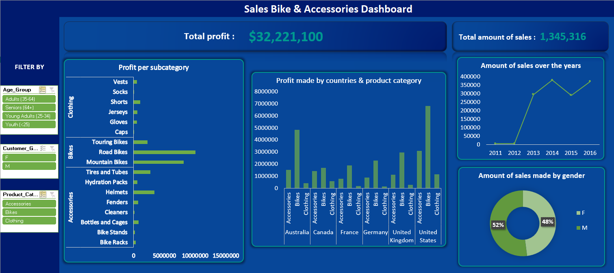
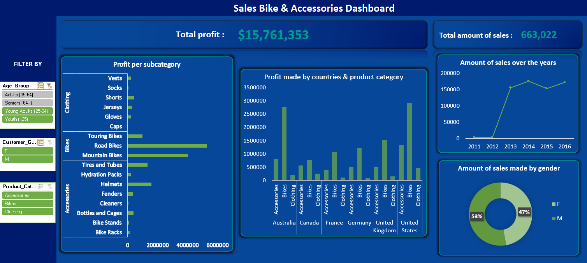
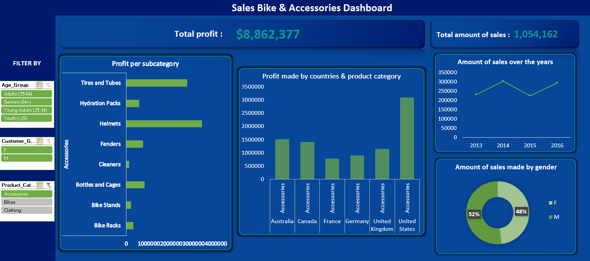
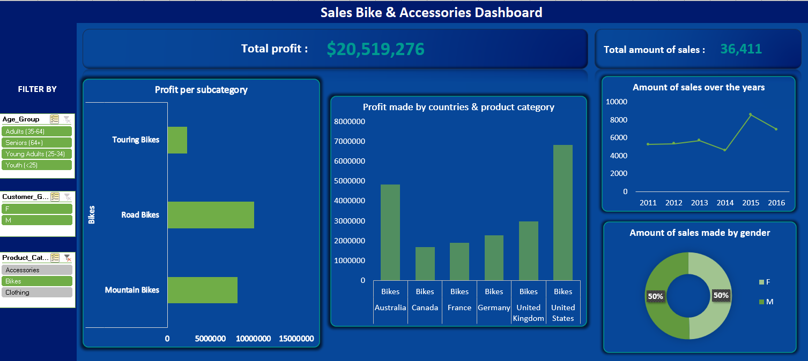
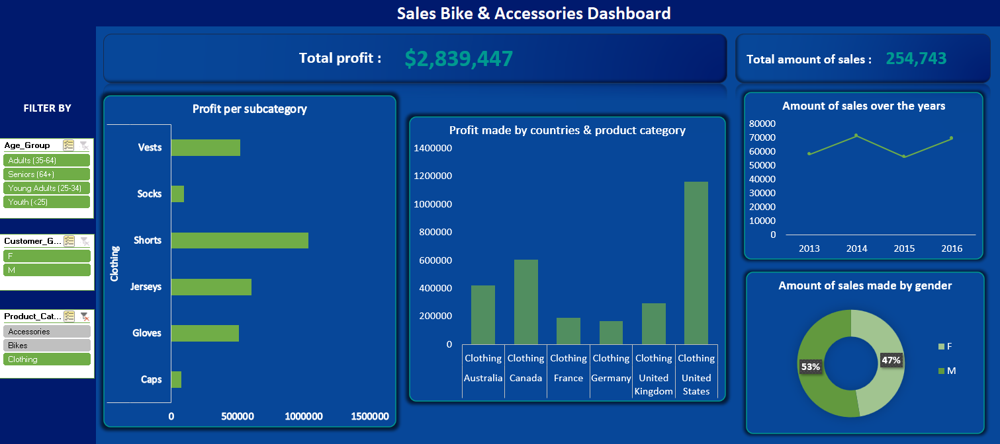
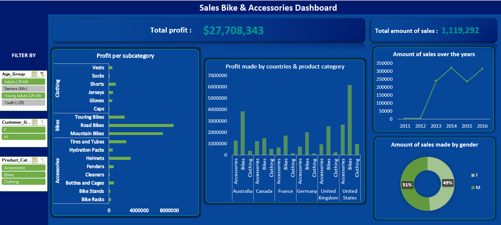

<h1 align="center">
     🚲 Bike Buyers 💵
       
      

     :chart_with_upwards_trend: Analysis of customer data from bike sales 
</h1>

The dataset is available via the following link: <a href="https://www.kaggle.com/code/sadiqshah/bike-store-sales-in-europe/data">Kaggle Link</a>. 
   
   
This dataset contains fictional customer data related to bike sales and is used for data exploration. It includes details such as the date, customer age, gender, country, state, product category and subcategory, product details, order quantity, cost, revenue, profit, and more. The data has been cleaned for analysis.
 
The attached Excel file includes the raw data, Pivot Tables, and an interactive dashboard featuring Pivot Charts and Slicers. The dashboard allows users to filter by age category, gender, and product category.
 
A screenshot of the dashboard is provided below for reference.

